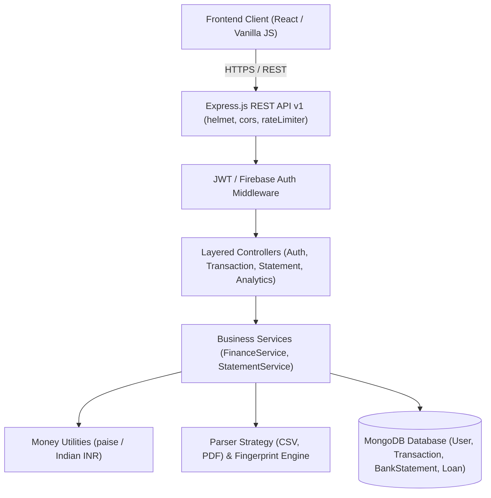
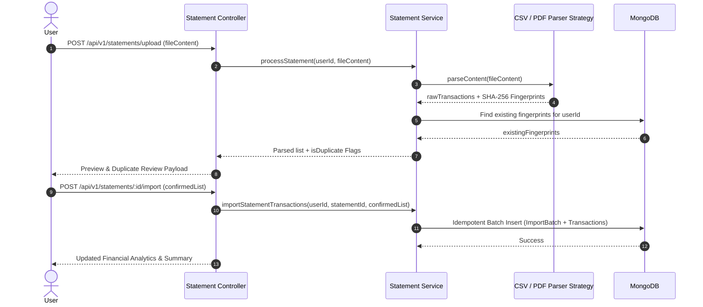

# System Architecture Documentation

## Overview

ProductivityOS Pro is an enterprise-grade MERN personal financial management SaaS engineered with a 4-layer backend design, exact integer minor unit (paise) monetary handling, and an idempotent bank statement parsing pipeline.

---

## High-Level Architecture Diagram

---

## Bank Statement Processing Pipeline Diagram

---

## Database Schemas & Indexing Strategy

1. **User**: `{ uid: 1 }` (unique), `{ email: 1 }` (unique), `{ familyId: 1 }`.
2. **Transaction**: `{ userId: 1, date: -1 }`, `{ userId: 1, type: 1, date: -1 }`, `{ userId: 1, fingerprint: 1 }`.
3. **BankStatement**: `{ userId: 1, createdAt: -1 }`.
4. **Loan**: `{ userId: 1, status: 1 }`.
5. **ImportBatch**: `{ userId: 1, statementId: 1 }`.
